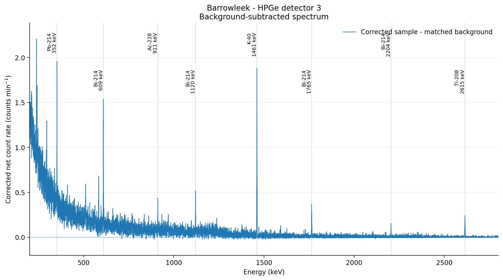
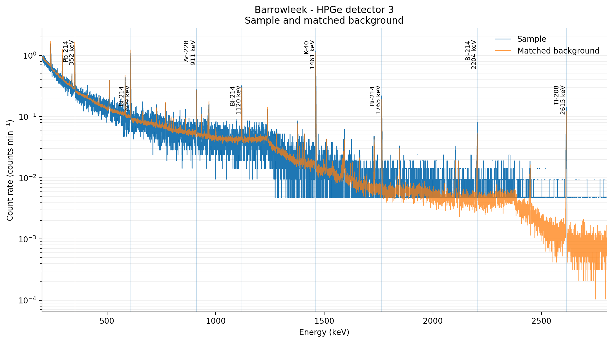
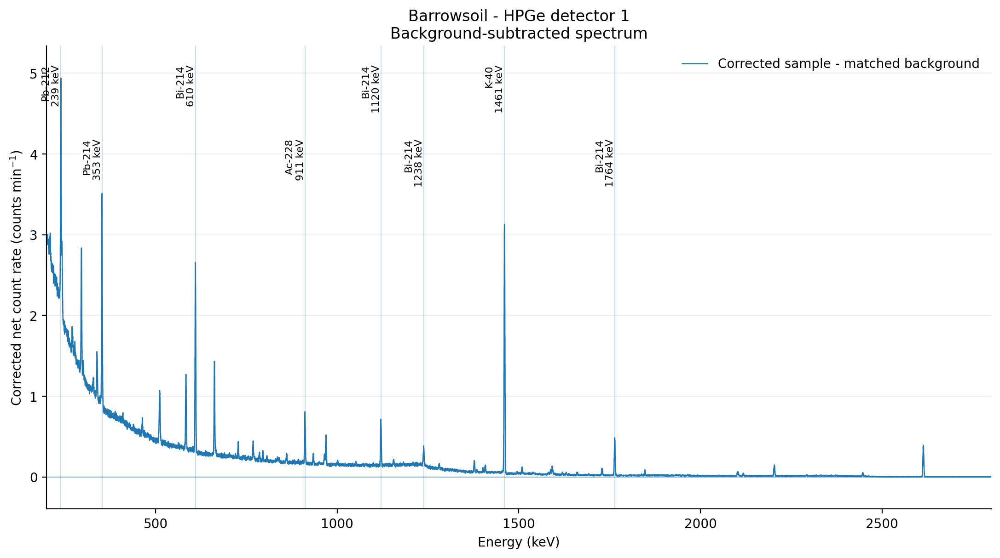

# HPGe Gamma Peak Analyser

Python analysis code developed from an environmental gamma-ray spectroscopy project at Lancaster University. The program reads GammaVision `.TKA` spectra, fits photopeaks in a sample and its detector-matched background separately, and calculates corrected count rates and activity estimates.

This is a later redevelopment of the Gamma Peak Analyser used during the original group project. The main aim was to improve the background subtraction, fit the measured peaks more reliably, and make sure the numerical results and plotted spectrum use exactly the same corrections.



## Main changes from the original analysis

- Peaks are fitted directly to the original counts rather than smoothed data.
- The sample and background peaks are fitted separately before subtraction.
- Uncertainty from the fitted background is included in the corrected result.
- Selected overlapping gamma lines are fitted together.
- Additional peak candidates are tested using the fitted detector resolution and a multiple-testing correction.
- The numerical corrected spectrum and plotted data are checked for exact agreement.
- The main calculations are covered by synthetic and regression tests.

This is not a new experiment. I continued developing the program after the group report was submitted, meaning the results from this version are a later reanalysis of the original measurements. Therefore, they should not be described as the exact results reported by the group in March 2026.

## Quick start

Python 3.10 or newer is recommended. Create and activate a virtual environment, then install the dependencies:

```bash
python -m venv .venv
pip install -r requirements.txt
```

Run the default Barrowleek sample:

```bash
python main.py
```

This prints the compact peak table and automatically creates:

```text
outputs/barrowleek_report.txt
outputs/barrowleek_spectrum.png
```

Run another registered sample by providing its `.TKA` filename:

```bash
python main.py "CARROTSDET1.TKA"
```

The available sample names can be listed using:

```bash
python main.py --list-samples
```

## Project context

The original project, *Natural Radioactivity of Soil and Produce from Different UK Radon Areas*, was completed in March 2026 by R. Hall, E. Nunn, O. O'Reilly, I. Procter, E. Rose and N. Rose.

The use of a high-purity germanium detector in gamma-ray spectroscopy allows accurate identification and activity analysis of radionuclides, even at low concentrations. This was desirable for the investigation into the radionuclide content of food produce grown in the UK, as concentrations were expected to be low for safe consumption. By studying areas in relation to their radon potential and exposure to human nuclear activity through Chernobyl and weapons testing, the chosen sample locations varied across the UK and covered low, medium and high radon potential locations, along with one area with expected Cs-137 content from Chernobyl fallout.

Soil and produce were collected from Essex, Wapley, Kendal, Wales, Barrow, Bath and Bill and Wendy's farm. Three HPGe detectors and two sizes of Marinelli beaker were used, with an approximately 160-hour background measurement available for each detector. The individual sample measurements ranged from roughly 2.5 to 160 hours.

The main isotopes found in the soil samples were K-40, Cs-137, Ac-228, Bi-214, Tl-208, Pb-212 and Pb-214. Ac-228, Bi-214, Tl-208, Pb-212 and Pb-214 were expected from the U-238 and Th-232 decay chains, whereas K-40 can be explained by potassium-rich soil and Cs-137 by nuclear fallout. Overall, the U-238 results broadly followed the expected radon pattern, and Barrow had the highest Cs-137 activity due to being an area exposed to nuclear fallout.

The activity comparison had significant uncertainty from detector efficiency and sample geometry. Because of this, I would treat the overall trend as more reliable than the exact difference between two individual samples.

## Example result

The Barrowleek spectrum contains 14 reference lines which pass the default $3\sigma$ threshold after the background and geometry corrections.

| Isotope | Fitted energy (keV) | FWHM (keV) | Significance | Corrected rate (counts min⁻¹ kg⁻¹) | Activity (Bq kg⁻¹) |
| --- | ---: | ---: | ---: | ---: | ---: |
| Pb-214 | 295.184 ± 0.031 | 1.002 | 7.07σ | 14.232 ± 2.014 | 5.669 ± 1.355 |
| Ac-228 | 338.266 ± 0.068 | 0.909 | 3.28σ | 4.944 ± 1.509 | 3.533 ± 1.278 |
| Pb-214 | 351.859 ± 0.019 | 1.007 | 11.90σ | 26.115 ± 2.194 | 6.128 ± 1.301 |
| Tl-208 | 583.228 ± 0.044 | 1.432 | 8.52σ | 13.083 ± 1.536 | 1.855 ± 0.434 |
| Bi-214 | 609.297 ± 0.021 | 1.302 | 14.35σ | 29.225 ± 2.037 | 8.056 ± 1.730 |
| Ac-228 | 911.069 ± 0.055 | 1.390 | 5.82σ | 6.883 ± 1.183 | 4.473 ± 1.211 |
| Ac-228 | 969.022 ± 0.084 | 1.673 | 4.37σ | 5.124 ± 1.172 | 5.691 ± 1.767 |
| Bi-214 | 1120.265 ± 0.053 | 1.618 | 7.30σ | 9.866 ± 1.352 | 13.040 ± 3.297 |
| Bi-214 | 1237.992 ± 0.093 | 1.382 | 3.05σ | 2.769 ± 0.909 | 10.060 ± 3.945 |
| Bi-214 | 1377.667 ± 0.123 | 2.108 | 4.30σ | 3.962 ± 0.921 | 22.548 ± 7.150 |
| K-40 | 1460.824 ± 0.021 | 1.855 | 23.23σ | 50.891 ± 2.191 | 113.505 ± 25.083 |
| Bi-214 | 1764.587 ± 0.059 | 2.023 | 8.32σ | 8.911 ± 1.072 | 16.062 ± 4.026 |
| Bi-214 | 2204.424 ± 0.095 | 1.801 | 4.71σ | 3.313 ± 0.703 | 21.025 ± 6.479 |
| Tl-208 | 2614.684 ± 0.076 | 2.267 | 5.11σ | 7.117 ± 1.394 | 2.609 ± 0.781 |

The strongest result is K-40 at 1460.824 keV, which reaches $23.23\sigma$, followed by the Bi-214 line at 609.297 keV with $14.35\sigma$. In comparison, the Bi-214 line at 1237.992 keV only reaches $3.05\sigma$, with the Ac-228 line at 338.266 keV reaching $3.28\sigma$. Both weaker lines pass the selected condition, but I would not discuss them with the same confidence as the much clearer K-40 peak.

The quoted activity uncertainties only contain the terms which could be reconstructed from the original project material. They are not a complete experimental uncertainty budget.

## Analysis method

### Energy calibration

Each detector has its own linear calibration which converts MCA channel $i$ into energy:

$$
E_i = m i + c,
$$

where $m$ is the calibration gradient and $c$ is its offset. The first stored count is assigned to channel two, matching the convention used during the original detector calibration.

Although a one-channel difference would be quite small on the full spectrum, it could change which reference line is closest to a weak fitted peak. Channel numbering and all three detector calibrations are therefore checked directly by the regression tests.

### Original data processing

To obtain a spectrum showing activity per kilogram across the different samples, it was important to remove the background spectrum belonging to each detector. The original Python script took the detector calibration, efficiency information and corresponding 160-hour background measurement. When combined with the live time for each spectrum, this produced a value per minute per kilogram which could be subtracted from the spectrum of the chosen sample.

A Savitzky-Golay filter was originally applied to reduce noise before the peaks were analysed. Noisy data causes issues beyond larger uncertainties and can cause false signals to be detected, with apparent peaks emerging from random variation in the measured counts. Furthermore, because the background spectrum contains some of the same isotopes being measured in the samples, noise can be present within a real peak. This can make one peak appear split into two smaller peaks which are then treated independently.

While the filter removed many small false peaks, I no longer use this approach for the fit in the updated version. Smoothing changes the measured channel values, and the result then depends partly on the filter settings rather than only the original detector counts. The filter made sense as a practical solution during the group project, but fitting the unsmoothed counts gives a clearer statistical interpretation.

### Why the subtraction was changed

The largest issue with the old subtraction became clear when looking closely at the positive and negative features around strong background lines. A small change in energy calibration between the sample and background measurements means that the same gamma line can sit in slightly different channels. Subtracting the channels first can then leave part of the peak positive and another part negative, even though it is the same background peak in both measurements.

This is especially problematic for an automatic analyser, as the remaining positive section could be identified as activity from the sample. It also explains why correcting the sign of the plotted subtraction on its own was not a complete fix. The calculation had to change as well.

The updated program fits the sample and background peak separately before performing the subtraction. Each fit is allowed to find its own peak centre, meaning a small energy movement does not force the two measured peaks to line up channel by channel. The fitted background area is scaled to the sample live time and then removed from the fitted sample area.

### Photopeak fitting

Each expected gamma line is checked in a small region of the raw spectrum. A Gaussian photopeak and a changing local background are fitted together, with the Gaussian area giving the fitted number of counts. Poisson statistics are used because the detection of a gamma ray is a random event and the spectrum records an integer number of events in each channel.

Selected lines which are very close in energy are fitted together. This avoids treating the whole overlapping shape as one isotope and allows a separate area to be estimated for each line. A fit is rejected when:

- its uncertainty is invalid;
- its peak centre reaches the allowed fitting boundary;
- its FWHM falls outside the accepted range; or
- the model does not describe the local counts well enough.

These are checks on the quality of the fit. They do not prove the isotope assignment by themselves.

### Background and geometry correction

For fitted sample area $S$, fitted background area $B$, sample-geometry correction $g$, sample live time $t_s$ and background live time $t_b$, the corrected area is

$$
A_{\mathrm{net}} = gS - \alpha B
\qquad
\alpha = \frac{t_s}{t_b}
$$

The fitted statistical uncertainty is

$$
u(A_{\mathrm{net}})
= \sqrt{[g\,u(S)]^2 + [\alpha\,u(B)]^2}
$$

The statistical uncertainty from the background is therefore carried through the same calculation. In the original report, this contribution was treated as negligible because the background measurement exceeded 500,000 seconds. This was reasonable as an initial approximation, but the background is still a measured count with its own fitted uncertainty. The newer version includes it rather than assuming the background is exact.

The plotted spectrum applies the equivalent correction to every detector channel:

$$
C_{\mathrm{plot}}(i) = gC_s(i) - \alpha C_b(i).
$$

The saved numerical spectrum and values passed to the plotting code must agree exactly. This prevents the graph and numerical output from silently using opposite subtraction signs.

Individual channels can still fall below zero after correction. This is expected because both spectra contain random counting variation, with the subtraction only removing the estimated background rather than the variation in either measurement. The fitted area across the complete peak is more important than whether one detector channel is above or below zero.

### Detection and activity

A reference line is accepted when the sample and background fits pass their checks, the corrected area is positive and its significance is above the selected threshold. The default threshold is $3\sigma$.

The corrected count rate is reported per minute and per kilogram. Where the gamma emission probability $I_\gamma$ is known, activity is calculated using

$$
R = \frac{A_{\mathrm{net}}}
{t_s\,m_s\,\varepsilon(E)\,I_\gamma}
$$

where $m_s$ is sample mass and $\varepsilon(E)$ is the detector photopeak efficiency at the fitted energy.

The detailed output keeps the results from before and after the geometry correction, making it possible to see how much of the final value came from this experimental correction.

### Search for unlisted peaks

The program can check the remaining spectrum for strong features outside the reference list. The clearer known peaks are used to estimate the detector resolution at different energies using

$$
\mathrm{FWHM}^2(E) = a + bE
$$

Searching many channels makes a random high point more likely, meaning the normal $3\sigma$ requirement cannot be applied in the same way. The required significance is increased to account for the number of positions tested.

Candidates are rejected when they are too close to:

- a known gamma line;
- an earlier accepted candidate;
- the 511 keV annihilation peak; or
- the expected single- and double-escape peaks.

An additional feature is left unidentified, even when it passes the search condition. One fitted energy is not sufficient evidence to assign an isotope, and an activity cannot be calculated unless the gamma emission probability is known.

## Output files

The default analysis produces a background-subtracted spectrum figure and a
detailed text report.

The corrected Barrowleek spectrum shown at the top contains only the
background-subtracted numerical data and accepted peak labels. The sample and
matched background can also be plotted together. This makes it easier to see
which lines were already present in the detector background before the fitted
peak areas are subtracted.



The analyser can be used on all of the registered samples, rather than only the
default Barrowleek file. Barrow soil gives a much clearer spectrum because it
was measured for considerably longer. It also provides an example from
Detector 1, with the K-40 and Cs-137 peaks remaining clear after the background
correction.



The detailed text report retains the separate sample and background fits, correction values and available uncertainty contributions. A CSV table can also be requested.

## Analysis options

```bash
# Print the separate fits and uncertainty terms
python main.py "BARROWLEEK.TKA" --verbose

# Use a five-standard-deviation detection threshold
python main.py "BARROWLEEK.TKA" --detection-sigma 5

# Ignore reference lines below 300 keV
python main.py "BARROWLEEK.TKA" --minimum-energy 300

# Skip the optional search for unlisted peaks
python main.py "BARROWLEEK.TKA" --no-discovery

# Include lines which did not pass the detection threshold
python main.py "BARROWLEEK.TKA" --show-nondetections

# Print the results without creating the automatic files
python main.py "BARROWLEEK.TKA" --no-output-files
```

Output paths can be changed individually:

```bash
python main.py "BARROWLEEK.TKA" \
  --save-report results/barrowleek_report.txt \
  --save-figure results/barrowleek_spectrum.png \
  --save-csv results/barrowleek_peaks.csv
```

## Tests

The project contains 29 regression tests. These cover:

- `.TKA` input and invalid data;
- channel numbering and detector calibration;
- background live-time scaling;
- recovery of a synthetic Gaussian peak;
- shifted sample and background peaks;
- selected overlapping gamma lines;
- the fitted detector-resolution model;
- the multiple-testing correction used by the candidate scan;
- geometry, detector efficiency, activity and uncertainty calculations;
- preserved sample and detector metadata; and
- the terminal, report, CSV and figure outputs.

Run the full test suite using:

```bash
python -m unittest discover -s tests -v
```

All 29 tests pass in the supplied version.

## Repository structure

```text
analysis.py        Runs the complete sample and background analysis
calibration.py     Energy, geometry, efficiency and activity calculations
peak_fitting.py    Photopeak fitting, resolution model and candidate search
peak_library.py    Environmental gamma-line reference list
plotting.py        Corrected and diagnostic spectrum figures
results.py         Terminal table, detailed report and CSV output
sample_data.py     Sample, background and detector metadata
tka_reader.py      GammaVision TKA reader
tests/             Regression tests
data/              Experimental sample and background spectra
examples/          Figures displayed in this README
```

## Limitations

- The energy calibrations, efficiency curves and geometry corrections are specific to the three detectors and sample arrangements used in the Lancaster project.
- Detector efficiency was the dominant uncertainty in the original experiment because of limited calibration data, geometry uncertainty and uncertainty in the fitted efficiency parameters.
- The final activity uncertainty includes the sample and background fitting terms, fitted detector-efficiency uncertainty and the Detector 3 geometry uncertainty where available.
- Matching geometry uncertainty values for Detectors 1 and 2 were not present in the surviving project material.
- Energy-calibration uncertainty, gamma-intensity uncertainty and some other systematic effects are not included.
- Passing the statistical threshold does not prove that an isotope has been uniquely identified. The rest of the decay chain and experimental context still need to support the assignment.
- Reference energies and gamma emission probabilities came from the original project files and should be checked against a current evaluated nuclear-data source before wider use.
- This is a research and teaching project rather than certified assay software.

Overall, the newer version fixes the main subtraction problem by fitting the sample and background separately, rather than relying on two complete spectra remaining perfectly aligned. It also ensures that the numerical output and graph use the same sign and corrections. The analyser is still specific to the three Lancaster detectors, but it now gives a clearer reanalysis of the original measurements.

## Data availability

The experimental `.TKA` spectra came from the Lancaster University project. Permission has been confirmed to include and redistribute these measurements with the analysis code.
